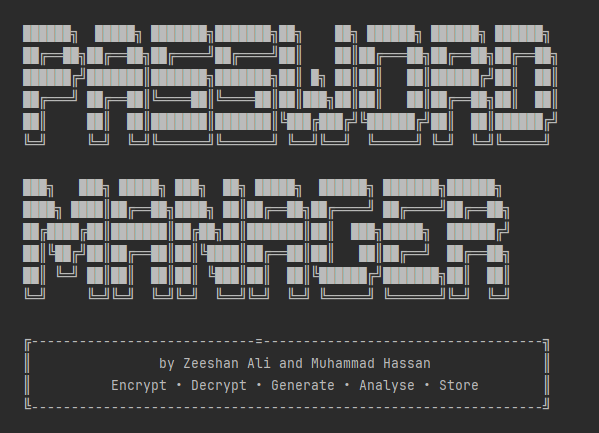

## Personal Password Manager
<p align="center">

</p>
         Encrypt • Decrypt • Generate • Analyse • Store 
> A feature-rich, terminal-based personal password manager written in Java.

* Tool Created by: Zeeshan Ali

---

## 📋 Table of Contents

- [Overview](#overview)
- [Features](#features)
- [Project Structure](#project-structure)
- [Getting Started](#getting-started)
- [Usage Guide](#usage-guide)
- [Security Architecture](#security-architecture)
- [Class Reference](#class-reference)
- [Demo Accounts](#demo-accounts)
- [Limitations & Disclaimer](#limitations--disclaimer)

---

## Overview

PassWord Manager is a command-line application that lets you securely store and manage your passwords and private notes in an encrypted local vault. Each user account is protected by a master password, and all vault data is saved to an encrypted `.dat` file on disk — unreadable without the application.

It also ships with a suite of standalone security tools: a Caesar cipher encryptor/decryptor, a password strength analyser, a strong password generator, a text case converter, vault statistics, and a common password leak checker.

---

## Features

### 🗄️ Vault Management
- **Add Password Entries** — store a platform name, username/email, password, and website URL
- **Add Secure Notes** — store freeform private text (PINs, keys, etc.)
- **View Entries (masked)** — see entry details with password hidden behind asterisks
- **Reveal Entries** — decrypt and display the full password after re-entering your master password
- **Delete Entries** — remove individual vault items
- **Search Vault** — find entries by title or username keyword
- **Clear Entire Vault** — wipe all entries after master password confirmation
- **Delete Account** — permanently remove your account and all associated data

### 👤 Account System
- **Sign Up** — create an account with name, email, and a master password (min. 6 characters)
- **Log In** — authenticate with email + master password
- **Change Master Password** — update your master password from the dashboard
- **Persistent Storage** — all data is saved to `vault_data/vault.dat` and reloaded on next run

### 🛠️ Tools
| Tool | Description |
|------|-------------|
| **Caesar Cipher** | Encrypt or decrypt any text using a Caesar shift (key 1–26) combined with Base64 encoding |
| **Password Strength Checker** | Score a password on 6 criteria with actionable improvement tips |
| **Password Generator** | Generate up to 3 strong passwords with configurable length (8–64) and character sets |
| **Text Case Converter** | Convert text to UPPERCASE, lowercase, Title Case, camelCase, snake_case, kebab-case, or reverse it |
| **Vault Stats Report** | View a breakdown of your vault — total entries, password health scores, and weak password names |
| **Leak / Common Password Check** | Flag passwords found in a list of the most commonly leaked credentials |

---

## Project Structure

```
.
├── Main.java                  # Entry point, menus, and all user interaction logic
│
├── vault_data/
│   └── vault.dat              # Encrypted vault file (auto-created on first run)
│
└── (all classes in Main.java)
    ├── InputValidator          # Email, URL, password, and range validation
    ├── FileEncryption          # XOR + SHA-256 + Base64 file-level encryption
    ├── StorageManager          # Read/write users and vault entries to disk
    ├── VaultEntry              # Abstract base class for vault items
    ├── PasswordEntry           # Stores a password entry (title, username, URL, encrypted password)
    ├── NoteEntry               # Stores a secure note (title, content)
    ├── CipherEngine            # Caesar cipher + Base64 encrypt/decrypt (implements Encryptable)
    ├── PasswordStrengthChecker # Scores passwords and gives improvement tips
    ├── PasswordGenerator       # Generates random strong passwords
    ├── PasswordLeakChecker     # Checks against a list of common leaked passwords
    ├── TextCaseConverter       # Converts text between 7 case/format styles
    ├── VaultStatsReport        # Prints vault health statistics
    ├── User                    # User model with vault management methods
    └── AuthManager             # Handles sign-up, login, account deletion, and persistence
```

---

## Getting Started

### Prerequisites

- **Java 8 or higher** installed on your machine
- A terminal / command prompt

### Compile

```bash
javac Main.java
```

### Run

```bash
java Main
```

The application will create a `vault_data/` directory automatically on first run and load (or create) the encrypted vault file.

---

## Usage Guide

### First Launch

On first launch, two demo accounts are seeded automatically (see [Demo Accounts](#demo-accounts)). You can log in with one of them or sign up with your own account.

### Navigation

The app has three menu levels:

```
Auth Menu
  └── Landing Menu
        ├── Dashboard (Vault)
        │     ├── Add Password Entry
        │     ├── Add Secure Note
        │     ├── View Entry (masked)
        │     ├── Reveal Entry (requires master password)
        │     ├── Delete Entry
        │     ├── Search Vault
        │     ├── Change Master Password
        │     ├── Clear Entire Vault
        │     └── Delete My Account
        └── Tools
              ├── Encrypt / Decrypt Text
              ├── Check Password Strength
              ├── Generate Strong Password
              ├── Text Case Converter
              ├── Vault Stats Report
              └── Leak / Common Password Check
```

### Adding a Password Entry

1. From the Dashboard, choose **1. Add Password Entry**
2. Enter the platform name (e.g. `Gmail`)
3. Enter your username or email
4. Enter your password — a strength report and leak check are shown immediately
5. Enter the full website URL (must start with `http://` or `https://`)

The password is encrypted using Caesar cipher + Base64 before being stored in the vault.

### Revealing a Password

1. Choose **4. Reveal Entry (decrypt + auth)**
2. Select the entry number
3. Enter your master password to confirm
4. The decrypted password is displayed

### Using the Caesar Cipher Tool

1. Go to **Tools → 1. Encrypt / Decrypt Text**
2. Choose Encrypt or Decrypt
3. Enter a key between 1 and 26 — **remember this key**, you need it to decrypt
4. Enter your text

The tool applies a Caesar shift first, then encodes the result in Base64 for the final ciphertext.

---

## Security Architecture

### Password Storage (Vault Entries)

Passwords saved in the vault are encrypted with a **Caesar cipher + Base64** scheme using a fixed internal shift key of `7`. This keeps passwords unreadable in the vault list but is not cryptographically strong — see the disclaimer below.

### File Encryption (vault.dat)

The vault file on disk is protected by a two-layer scheme:

1. **SHA-256 key derivation** from a hardcoded passphrase (`P@ssW0rd_V@ult_S3cr3t_K3y_2025!`)
2. **XOR transform** applied byte-by-byte over the JSON data
3. **Base64 encoding** of the result

This makes the file unreadable as plain text, but the key is embedded in the source code.

### Master Password

Master passwords are stored and compared in plain text (no hashing). This means the vault file, if decrypted, would expose them.

---

## Class Reference

| Class / Interface | Role |
|---|---|
| `Manageable` | Interface requiring `display()` and `getSummary()` |
| `Encryptable` | Interface requiring `encrypt()` and `decrypt()` methods |
| `InputValidator` | Static helpers for validating email, URL, master password, and integer ranges |
| `FileEncryption` | XOR + SHA-256 + Base64 encryption/decryption for the vault file |
| `StorageManager` | Serialises/deserialises `User` objects to/from `vault.dat` using hand-rolled JSON |
| `VaultEntry` | Abstract base for `PasswordEntry` and `NoteEntry`; holds title, username, createdAt |
| `PasswordEntry` | Concrete vault item for credentials; stores an encrypted password and URL |
| `NoteEntry` | Concrete vault item for freeform secure notes |
| `CipherEngine` | Caesar cipher (letters + digits) with Base64 wrapping; implements `Encryptable` |
| `PasswordStrengthChecker` | Scores passwords across 6 dimensions and returns a formatted ASCII report |
| `PasswordGenerator` | Builds random passwords from configurable character pools with guaranteed diversity |
| `PasswordLeakChecker` | Compares against a 30-entry list of the most common leaked passwords |
| `TextCaseConverter` | Converts strings to 7 different case/format styles |
| `VaultStatsReport` | Aggregates and prints vault entry counts and password health breakdown |
| `User` | Holds user profile, master password, and vault; provides add/delete/search/list methods |
| `AuthManager` | Manages the user list, handles sign-up/login flow, and triggers persistence |
| `Main` | Application entry point; owns the menu loops and calls all feature methods |

---

## Demo Accounts

Two demo accounts are seeded automatically on first run (if no vault file exists):

| Name | Email | Master Password | Vault Contents |
|------|-------|----------------|----------------|
| Zeeshan Ali | zeeshan@gmail.com | zeeshan7822 | Gmail, Facebook, GitHub, Instagram passwords + 2 secure notes |
| Muhammad Hassan | hassan@gmail.com | hassan123 | Instagram, LinkedIn passwords + 1 secure note |

> **Note:** These accounts are for testing only. Delete them or clear their vaults before using the app for real credentials.

---

## Limitations & Disclaimer

> ⚠️ **This project is for educational purposes.**

- The Caesar cipher used for password storage is **not cryptographically secure**. A production password manager should use AES-256 or similar.
- The master password is stored and compared in **plain text** — no hashing (e.g. bcrypt/Argon2) is applied.
- The file encryption key is **hardcoded in source code** — anyone with access to the source can decrypt the vault file.
- There is **no clipboard integration** — passwords must be read from the terminal.
- All data is stored **locally only** — there is no sync or backup mechanism.

This project demonstrates core OOP concepts in Java including inheritance, interfaces, polymorphism, encapsulation, file I/O, and input validation.

---

*Made with ☕ and Java by Zeeshan Ali *
